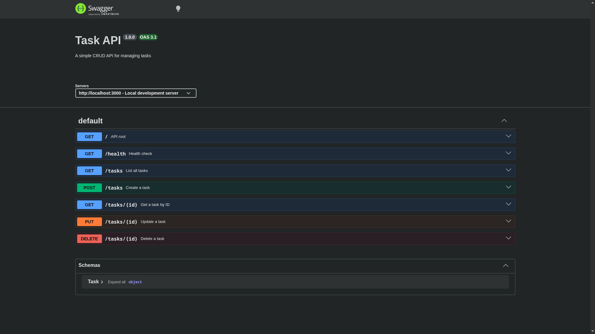

# CRUD API

A simple Express.js REST API for managing tasks. Built as an internship project.

## Install & Run

```bash
npm install && node index.js
```

The server starts at `http://localhost:3000`. Swagger UI is available at `/docs`.

## Endpoints

| Method | Path         | Description               |
|--------|--------------|---------------------------|
| GET    | `/`          | API info                  |
| GET    | `/health`    | Health check              |
| GET    | `/tasks`     | List all tasks            |
| GET    | `/tasks/:id` | Get a task by ID          |
| POST   | `/tasks`     | Create a task             |
| PUT    | `/tasks/:id` | Update a task             |
| DELETE | `/tasks/:id` | Delete a task             |

## Examples

### GET `/` — API info

```bash
curl -i http://localhost:3000/
```

```
HTTP/1.1 200 OK
Content-Type: application/json; charset=utf-8

{"name":"Task API","version":"1.0","endpoints":["/tasks"]}
```

### GET `/health` — Health check

```bash
curl -i http://localhost:3000/health
```

```
HTTP/1.1 200 OK
Content-Type: application/json; charset=utf-8

{"status":"ok"}
```

### GET `/tasks` — List all tasks

```bash
curl -i http://localhost:3000/tasks
```

```
HTTP/1.1 200 OK
Content-Type: application/json; charset=utf-8

[{"id":1,"title":"Buy milk","done":false},{"id":2,"title":"Write code","done":true},{"id":3,"title":"Go for a walk","done":false}]
```

### GET `/tasks/1` — Get a task by ID

```bash
curl -i http://localhost:3000/tasks/1
```

```
HTTP/1.1 200 OK
Content-Type: application/json; charset=utf-8

{"id":1,"title":"Buy milk","done":false}
```

### POST `/tasks` — Create a task

```bash
curl -i -X POST http://localhost:3000/tasks \
  -H 'Content-Type: application/json' \
  -d '{"title":"Test task"}'
```

```
HTTP/1.1 201 Created
Content-Type: application/json; charset=utf-8

{"id":4,"title":"Test task","done":false}
```

### PUT `/tasks/1` — Update a task

```bash
curl -i -X PUT http://localhost:3000/tasks/1 \
  -H 'Content-Type: application/json' \
  -d '{"done":true}'
```

```
HTTP/1.1 200 OK
Content-Type: application/json; charset=utf-8

{"id":1,"title":"Buy milk","done":true}
```

### DELETE `/tasks/4` — Delete a task

```bash
curl -i -X DELETE http://localhost:3000/tasks/4
```

```
HTTP/1.1 204 No Content
```

## Swagger UI

Open `http://localhost:3000/docs` in your browser.


